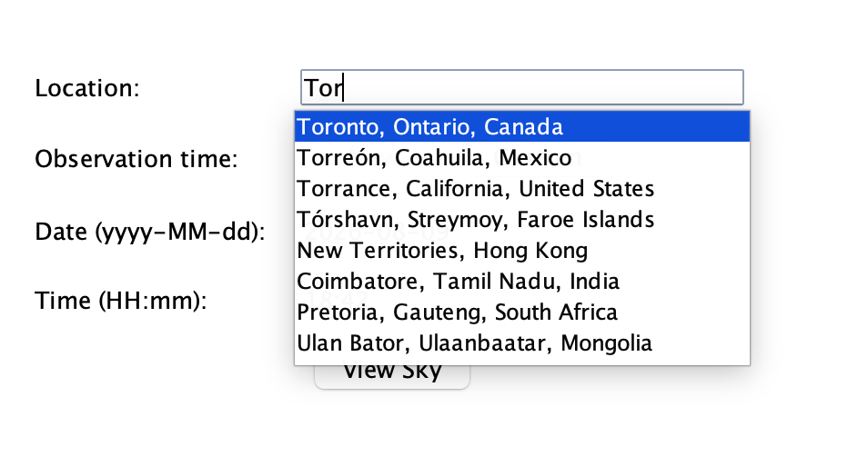
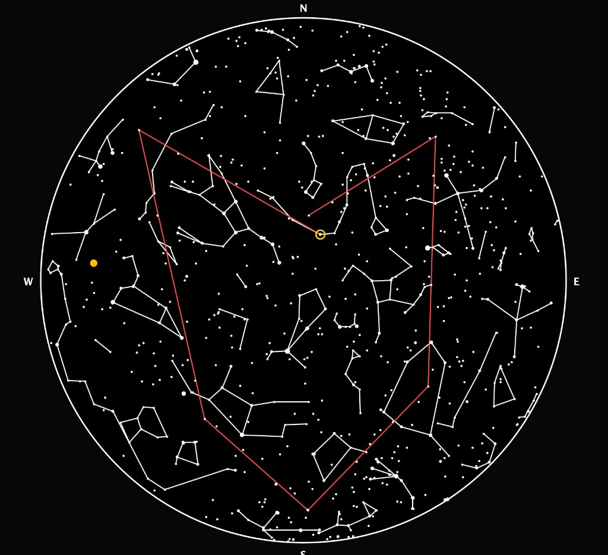
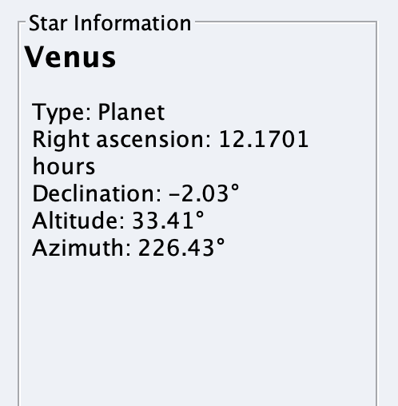
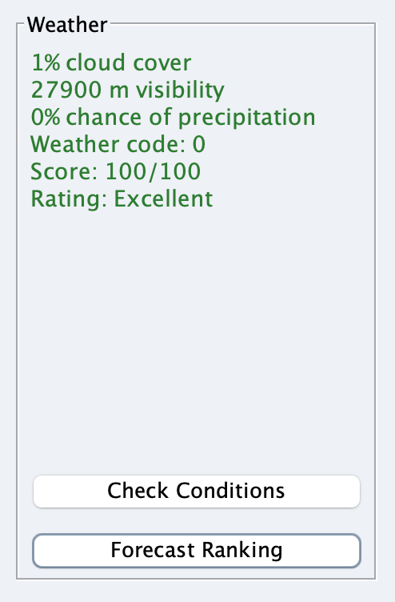
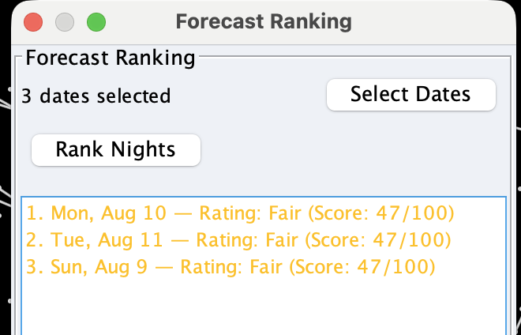

# Halo

**Authors:** Rayce Su, Deniz Coban, Bryan Kim, and Rachel Yeung  
**Team:** Star Dictators  
**Course:** CSC207, University of Toronto

Halo is an interactive desktop stargazing application. Choose an Earth location,
date, and local time, then generate a dynamic circular sky map with catalogue
stars, built-in constellation lines, Solar System objects, weather context, and
tools for searching objects and drawing custom constellations.

Halo was built as a CSC207 Clean Architecture project to help people plan
observing sessions: see what is above the horizon at a given place and time, and
estimate whether the weather looks suitable for stargazing.

## Table of contents

1. [Summary](#summary)
2. [Features](#features)
3. [Installation](#installation)
4. [Usage](#usage)
5. [License](#license)
6. [Feedback](#feedback)
7. [Contributions](#contributions)
8. [Technical notes](#technical-notes)
   - [Location resolution](#location-resolution)
   - [Viewing quality rating](#viewing-quality-rating-check-conditions)

## Summary

Halo solves a practical observing problem: given where you are and when you want
to look up, what is in the sky, and how good do the conditions look?

The application is a Java Swing desktop app. The star map is drawn dynamically
with Graphics2D (not a static image). Weather and planetary data use public APIs
when a network connection is available; the catalogue sky map still works if
those services fail.

**Technology**

- Java 17
- Java Swing and Java2D
- Maven
- JUnit 5

## Features

### Location autocomplete

Type a place name and pick a suggestion from a bundled city dataset. Selecting a
city resolves latitude, longitude, and time zone for the observation.



### Dynamic sky map

View a circular horizon map with zenith at the centre, North at the top, and
stars sized by apparent magnitude. Built-in constellation lines and suitable
Solar System objects (such as planets) appear when data is available. Zoom and
pan are supported on the map panel.



### Object search and details

Search by display name, or click a visible object on the map. The sidebar shows
coordinates and related details for the selected object.



### Weather and viewing-quality estimate

Check general weather factors from Open-Meteo and see an overall viewing-quality
**estimate** (not a guarantee) based on cloud cover, visibility, precipitation
probability, and weather code.



### Forecast ranking

Select several dates and rank nights by the same viewing-quality score so you
can compare which evenings look better for observing.



### Custom constellations

Create and display custom constellation lines connecting catalogue stars. Custom
shapes are drawn on the sky map (shown in red in the sky map screenshot above).

## Installation

### Requirements

| Software | Required version | Download |
| --- | --- | --- |
| Java JDK | 17 or newer | [Adoptium / Eclipse Temurin](https://adoptium.net/) |
| Apache Maven | 3.8 or newer | [Maven downloads](https://maven.apache.org/download.cgi) |

Halo is a desktop GUI application. It runs on **macOS, Windows, and Linux** when
a graphical display is available. It is not intended for headless servers.

No API keys or environment variables are required. Optional network access is
used for:

- [Open-Meteo](https://open-meteo.com/) weather forecasts
- [USNO Astronomical Applications API](https://aa.usno.navy.mil/data/api) celestial data

If those services are unreachable, the catalogue star map still loads; weather
and some Solar System features may be unavailable.

### Steps

1. Install Java 17+ and Maven (see links above).
2. Confirm the tools are on your `PATH`:

   ```bash
   java -version
   mvn -version
   ```

   `java -version` should report version 17 or higher.

3. Clone the repository and enter the project directory:

   ```bash
   git clone https://github.com/raycesu/Halo.git
   cd Halo
   ```

4. Compile the project:

   ```bash
   mvn clean compile
   ```

5. (Optional) Run the automated tests:

   ```bash
   mvn clean test
   ```

### Common installation issues

| Issue | What to try |
| --- | --- |
| `java` / `mvn` not found | Install the JDK and Maven, then restart the terminal so `PATH` updates apply. |
| Wrong Java version | Point `JAVA_HOME` at a JDK 17+ install. Check with `java -version`. |
| Compile or test failures after a fresh clone | Run `mvn clean test` again; ensure you are in the repository root that contains `pom.xml`. |
| App window never appears | Make sure you are not on a headless machine. Run from a normal desktop session or IDE. |
| Weather or planets missing | Check your network / firewall. The sky map should still open without those APIs. |

## Usage

### Launch the application

From the project root, either:

**Option A — Maven Exec plugin**

```bash
mvn -q exec:java -Dexec.mainClass="app.Main"
```

**Option B — IDE**

Open the project in IntelliJ IDEA (or another Java IDE), then run the `main`
method in `app.Main`.

### Typical workflow

1. On the setup screen, type a **Location** and choose a suggestion from the
   dropdown (see the location screenshot under [Features](#features)).
2. Enter the observation **Date** (`yyyy-MM-dd`) and **Time** (`HH:mm`).
3. Click **View Sky**. A short loading screen appears while positions are
   calculated, then the sky view opens.
4. Explore the circular map: scroll to zoom, drag to pan, and click a star or
   planet to open **Star Information**.
5. Use the search field in the sky view to find an object by name.
6. Open **Check Conditions** for weather and the viewing-quality estimate, or
   **Forecast Ranking** to compare nights.
7. Use **Custom Constellation** controls to draw and display your own star
   patterns on the map.

## License

This project is released under the [MIT License](LICENSE). You may use, copy,
modify, and distribute the software under the terms of that license.

## Feedback

We welcome feedback on Halo.

**Submit feedback:** [Halo Feedback (Google Form)](https://docs.google.com/forms/d/e/1FAIpQLScDeVrA0JET1mLAg1GyO4G58SgjziMUkGAg3Swp4Q6UzTMFQA/viewform?usp=sharing&ouid=112123536031761054902)

### What counts as valid feedback

- Bug reports with steps to reproduce (OS, Java version, what you clicked, what
  you expected vs what happened)
- Feature ideas related to stargazing, the sky map, weather, or usability
- Documentation corrections (unclear install or usage steps)
- Accessibility or UI clarity notes

Please do **not** submit passwords, API keys, personal secrets, or unrelated
spam.

### What to expect

The Star Dictators team reviews form responses during the CSC207 project
timeline. We may not reply to every submission individually, but constructive
reports help prioritize fixes and documentation updates.

## Contributions

Contributions are welcome while the course project is active.

### How to contribute

1. Fork the repository on GitHub.
2. Clone your fork and create a focused branch from `main`:

   ```bash
   git checkout main
   git pull
   git checkout -b feature/short-description
   ```

3. Make your changes. Prefer small, focused pull requests over large mixed
   changes.
4. Run tests before opening a pull request:

   ```bash
   mvn clean test
   ```

5. Push your branch and open a pull request against `main` on
   [raycesu/Halo](https://github.com/raycesu/Halo).

### Guidelines for a good pull request

- Describe **why** the change is needed and what it affects
- Keep the change scoped to one feature or fix
- Follow Clean Architecture boundaries used in this project (see
  [`.cursor/rules/halo-project-architecture.mdc`](.cursor/rules/halo-project-architecture.mdc))
- Update or add tests when behaviour changes
- Do not commit secrets or local IDE clutter

### Review and merge protocol

- Maintainers review for correctness, architecture fit, and passing tests
- Requested changes should be addressed on the same branch
- A maintainer merges after approval when `mvn clean test` succeeds and the
  diff matches the PR description

## Technical notes

The sections below document two domain areas in more detail. UML diagrams for
use cases live under [`docs/uml/`](docs/uml/).

### Location resolution

Every data source Halo talks to is addressed by latitude and longitude:
Open-Meteo, the USNO ephemeris service, and the coordinate conversion behind the
star map. A place name is what the user has, so `LocationDataAccessInterface`
bridges the two.

`CsvLocationDataAccessObject` resolves names against a bundled extract of the
GeoNames `cities15000` dataset, trimmed to 1,000 places and to the columns Halo
needs: name, region, country, coordinates, IANA time zone and population. A
local dataset rather than a geocoding service, because unlike weather and
ephemerides this data does not change, the lookup cannot fail on a dropped
connection, and it is fast enough to run on every keystroke.

The 1,000 are chosen in order:

1. the largest cities of North America — 200 Canadian, 250 American, 50 Mexican —
   weighted towards Canada because that is where the application's users are
2. the largest city of every remaining country, so nowhere on earth is unreachable
3. the most populous cities left over, worldwide

Canadian coverage therefore reaches down to towns of about 37,000 (Guelph,
Barrie, Kingston), American to about 127,000, while all 243 countries remain
represented.

Matching is ranked in tiers — exact name, then prefix, then substring — and
within a tier by population, so "York" surfaces York before New York and
"Springfield" leads with the largest one. Names are folded to strip case and
accents, so "sao paulo" finds São Paulo.

`CityAutocompleteField` shows the matches as the user types. It hands back an
`ObserverLocation` only when a suggestion is actually chosen, and clears it
again if the text is edited afterwards, so a half-typed name can never be
silently resolved to somewhere else.

The resolved `ObserverLocation` is what travels into the use cases, carrying the
time zone with it. That is what lets the weather request name its zone
explicitly rather than having Open-Meteo infer one from the coordinates.

#### Coverage

Places outside the bundled 1,000 are not resolvable. The remedy is another
implementation of `LocationDataAccessInterface` backed by a geocoding service;
nothing above the DAO would change.

### Viewing quality rating (Check Conditions)

Halo rates how suitable forecast weather is for stargazing. The Check Conditions
use case fetches weather for the selected location and time, then scores it with
a shared domain rubric in `ViewingQualityRating`. The Rank Forecast Days use
case reuses the same scoring formula so nights can be compared consistently.

Weather failure does not block the mathematical sky map. The score is an
**estimate**, not a guarantee of observing conditions.

#### Inputs

Each forecast moment is represented as a `WeatherCondition` with four factors
from Open-Meteo:

| Factor | Field | Units |
| --- | --- | --- |
| Cloud cover | `cloudCoverPercent` | 0–100 % |
| Visibility | `visibilityMeters` | metres |
| Precipitation probability | `precipitationProbabilityPercent` | 0–100 % |
| Weather code | `weatherCode` | WMO weather interpretation code |

#### Overall score formula

Each factor is first converted into a **0–100 sub-score**, then combined with
fixed weights:

```text
overallScore =
    cloudCoverScore        * 0.35
  + weatherCodeScore       * 0.30
  + precipitationScore     * 0.20
  + visibilityScore        * 0.15
```

Weights reflect stargazing priorities: clear skies matter most, then the general
sky state (WMO code), then rain/snow chance, then how far you can see through
haze or fog.

#### Continuous factor curves (piecewise-linear)

Cloud cover, visibility, and precipitation use piecewise-linear interpolation
between anchor points. Values outside the first/last anchor clamp to the end
score.

**Cloud cover** (lower is better):

| Cloud cover (%) | Score |
| ---: | ---: |
| 0 | 100 |
| 10 | 90 |
| 30 | 65 |
| 60 | 40 |
| 100 | 0 |

**Visibility** (higher is better):

| Visibility (m) | Score |
| ---: | ---: |
| 0 | 0 |
| 2,000 | 15 |
| 5,000 | 45 |
| 10,000 | 75 |
| 20,000 | 100 |

**Precipitation probability** (lower is better):

| Precip. probability (%) | Score |
| ---: | ---: |
| 0 | 100 |
| 10 | 85 |
| 30 | 55 |
| 50 | 25 |
| 100 | 0 |

#### Weather code sub-score (WMO)

The weather code maps to a discrete 0–100 score. Unrecognized codes fall back to
a neutral **50** so scoring never crashes on an unknown code.

| Codes | Meaning (approx.) | Score |
| --- | --- | ---: |
| 0 | Clear sky | 100 |
| 1 | Mainly clear | 90 |
| 2 | Partly cloudy | 65 |
| 3 | Overcast | 40 |
| 45, 48 | Fog / depositing rime fog | 20 |
| 51–57 | Drizzle (incl. freezing) | 20 |
| 61–67 | Rain (incl. freezing) | 10 |
| 71–77 | Snow / snow grains | 10 |
| 80–86 | Rain/snow showers | 5 |
| 95, 96, 99 | Thunderstorm | 0 |
| other | Unrecognized | 50 |

#### Rating buckets

The overall 0–100 score is bucketed into a label for display:

| Score range | Rating |
| --- | --- |
| ≥ 75 | EXCELLENT |
| ≥ 50 and &lt; 75 | GOOD |
| ≥ 25 and &lt; 50 | FAIR |
| &lt; 25 | POOR |

#### Where this lives in the code

- `entity.ObserverLocation` — the resolved place: name, coordinates, time zone
- `entity.weather.WeatherCondition` — holds the four weather factors
- `entity.weather.ViewingQualityRating` — pure scoring/rubric (unit-testable, no network)
- `use_case.check_conditions.CheckConditionsInteractor` — fetch → score → present one moment
- `use_case.rank_forecast_days.RankForecastDaysInteractor` — scores each selected night with the same rubric, then sorts by overall score (descending)
